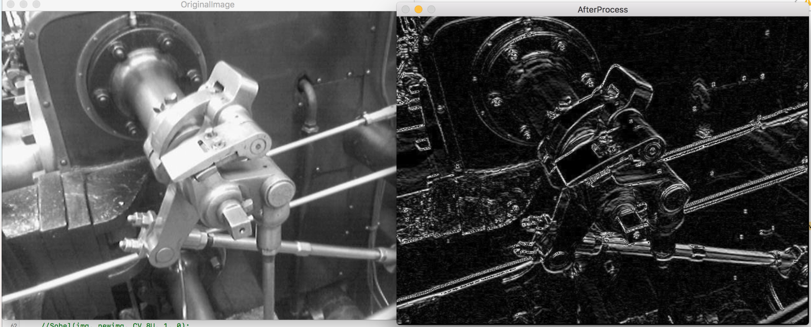

# DICOM - Teilaufgabe 1

Um DICOM-Dateien anzeigen zu können, müssen wir sie zunächst einlesen können. Zudem soll für die Diagnostik eine Kantendetektion angeboten werden - um diese kümmern wir uns direkt mit.

## Projektsetup

Bei dem DICOM-Format handelt es sich um ein komplexes Containerformat für Bilddateien (ein Überblick ist z.B. [hier](http://dicom.nema.org/medical/dicom/current/output/chtml/part10/chapter_7.html) zu finden). Um ein solch komplexes Dateiformat einzulesen, bietet sich die Verwendung einer existierenden Bibliothek an - in diesem Fall [das pixelmed DICOM-Toolkit](https://www.pixelmed.com/dicomtoolkit.html). Schauen Sie bitte zunächst in die build.gradle, um sich damit vertraut zu machen.

Das DICOM-Toolkit ist im [Maven-Repository](https://mvnrepository.com/artifact/com.pixelmed/dicom) zu finden. Wir verwenden die Version [20120929](https://mvnrepository.com/artifact/com.pixelmed/dicom/20120929). Auf dieser Seite ist unten der Verweis zu finden, dass sich das Artefakt im Gazelle-Repository befindet. Entsprechend muss die repositories-Liste in build.gradle wie folgt angepasst werden:

```java
repositories {
    mavenCentral()
    maven{
        url "https://gazelle.ihe.net/nexus/content/repositories/releases/"
    }
}
```

Die Zeile, welche in den dependencies-Bereich eingefügt werden muss, um das Artefakt in dem Projekt zu verwenden, steht im "gradle"-Tab auf der selben Webseite. Angepasst sehen unsere Dependencies nun wie folgt aus:

```java
dependencies {
    testImplementation 'org.junit.jupiter:junit-jupiter-api:5.7.0'
    testRuntimeOnly 'org.junit.jupiter:junit-jupiter-engine:5.7.0'
    testRuntimeOnly 'org.junit.platform:junit-platform-launcher'
    implementation 'com.pixelmed:dicom:20120929'
}
```

## Hintergrundinformationen: DICOM-Format

## Einlesen von DICOM-Dateien

Der folgende Codeabschnitt zeigt Ihnen, wie die Bilddaten aus einer DICOM-Datei eingelesen werden können (Sie können Beispiele auch selber ergoogeln, beispielsweise [dieses Tutorial](https://saravanansubramanian.com/blog/extractdicomimagedata/)):

```java
import com.pixelmed.dicom.AttributeList;
import com.pixelmed.display.SourceImage;

import javax.imageio.ImageIO;
import java.awt.image.BufferedImage;
import java.io.File;
import java.io.IOException;

public class DICOMTest {
    public static void main(String[] args) {
        String infilename = "data/angiogram1.DCM";
        BufferedImage image = null;
        try {
            AttributeList fileattributes = new AttributeList();
            // Metadaten der Datei einlesen
            fileattributes.read(infilename);
            // Bilddaten einlesen
            SourceImage dcImage = new SourceImage(fileattributes);
            // Bild 4 aus Bilddaten in BufferedImage einlesen
            image = dcImage.getBufferedImage(4);
        } catch (Exception e) {
            System.out.println("Error reading image file: " + e.getMessage());
        }
        try {
            ImageIO.write(image, "png", new File("frame4.png"));
        } catch (IOException e) {
            System.out.println("Error writing png file: " + e.getMessage());
        }

    }
}
```

Diesen Code finden Sie auch zum selber-ausprobieren in der Klasse `DICOMTest`.

### Kantendetektion mit dem Sobel-Filter

Neben dem Einlesen von DICOM-Dateien soll auch eine Kantendetektion zur Unterstützung der Diagnostik stattfinden. Dafür verwenden wir einen einfachen Filter, den Sobel-Operator. Dieser addiert und subtrahiert die Werte der direkt über/unter (für die Detektion horizontaler Kanten) bzw. neben (für die Detektion vertikaler Kanten) einem Pixel liegenden Pixel so, dass sich bei starken Veränderungen der Frabintensität große Werte ergeben. Auf Flächen mit ungefähr gleichbleibender Intensität löschen sich hingegen die Werte der umliegenden Pixel aus.

Zur Veranschaulichung hier die Matrix, nach der die Summierung für die Detektion vertikaler Kanten durchgeführt wird:

```text
| 1 0 -1 |
| 2 0 -2 |
| 1 0 -1 |
```

Der Referenzpixel, für den die Kantendetektion durchgeführt wird, wird durch die 0 in der Mitte der Matrix repräsentiert. Die umliegenden Pixel werden mit den umliegenden Werten multipliziert, dann werden alle Werte summiert.

Die Pixelwerte auf der linken Seite werden also mit 2 (direkt links vom Referenzpixel) bzw. mit 1 (links oben und links unten vom Referenzpixel) multipliziert. Die Pixelwerte auf der rechten Seite werden umgekehrt mit -2 (direkt rechts vom Referenzpixel) bzw. mit -1 (rechts oben und rechts unten vom Referenzpixel) multipliziert.

Auf einer Fläche mit in etwa gleichbleibender Farbintensität löschen sich also die Werte der Pixel auf der linken Seite mit den Werten der rechten Seite gegenseitig aus, für die Kantenintensität kommt ein Wert nache 0 raus. Sind allerdings die Farbwerte auf der linken Seite des Referenzpixels höher, als die auf der rechten Seite, funktioniert das gegenseitige Auslöschen nicht mehr, und es kommt ein hoher Wert zustande. Umgekehrt entsteht ein negativer Wert, wenn die Farbintensität rechts vom Referenzpixel höher ist, als links.

Die gleiche Matrix kann um 90 Grad gedreht für die Detektion horizontaler Kanten verwendet werden:

```text
|  1  2  1 |
|  0  0  0 |
| -1 -2 -1 |
```

Eine Detektion von beiden Kantenrichtungen findet statt, indem beide Kantendetektionen (horizontal, ```Gx``` und vertikal, ```Gy```) durchgeführt und die beiden Ergebnisse mit der folgenden Formel kombiniert werden: ```G=sqrt(Gx*Gx + Gy*Gy)```.

Ein Beispielbild einer solchen Kantendetektion ist [hier](https://github.com/hkclki/Sobel-Filter) (mit Beispiel-C-Code) zu sehen:



Bitte beachten Sie ein paar Implementationsdetails:

* Die berechneten Farbwerte können negativ werden - das ergibt keinen Sinn (zumindest nicht für die Darstellung, und wir berechnen hier keine Richtungsinformation), entsprechend sollten Sie für das Kantenbild die Absolutwerte der berechneten Grauwerte verwenden
* Die Kantendetektion wird auf Grauwerten durchgeführt, Sie müssen Pixel von Farbbildern also zunächst in Grauwerte umrechnen. Der empfundene Grauwert eines RGB-Wertes kann nach der Formel: ```Grauwert = 0.2126*Rotwert + 0.7152*Grünwert + 0.0722*Blauwert``` berechnet werden. Hintegrund ist das durch die unterschiedlichen Rezeptoren im menschlichen Auge hervorgerufene Helligkeitsempfinden.  
* Sie werden für die Implementation der Kantendetektion als Ergebnis ein Bild im Farbmodus ```BufferedImage.TYPE_BYTE_GRAY``` verwenden, die dort gespeicherten Pixelwerte können also maximal 255 sein. Das Quellbild wird in der Regel ein volles RGB-Bild mit integer-Werten für die Pixel sein, also können die berechneten Kantenwerte viel größer als 255 werden. Sie sollten sich also bei der Berechnung den maximalen berechneten Farbwert merken und diesen nutzen, um alle Werte auf maximal 255 zu skalieren (also mit dem Skalierungsfaktor ```scale = 255/maxValue``` zu multiplizieren) 

## DICOMImage: Verwaltung eines DICOM-Bildes

Implementieren Sie mit diesem Wissen eine Klasse ```DICOMImage```, die alle Frames eines DICOM-Bildes einliest und verwaltet. Lesen Sie bitte zunächst die Aufgabe bis zum Ende: Es ist sehr empfehlenswert, die Implementation nicht stur in dieser Reihenfolge durchzuführen, sonder stückweise ```DICOMImage``` und ```DICOMFrame``` parallel zu implementieren, so dass man immer testen kann, ob die bisher implementierte Funktionalität auch korrekt ist.

```DICOMImage``` soll folgende Methoden enthalten:
* Einen Constructor ```DICOMImage(File infile, String name)```: Bekommt die DICOM-Datei sowie einen Namen als Argumente. Merkt sich den Namen, und liest alle frames aus ```infile``` in eine interne Liste (am besten eine ```ArrayList``` - wir werden immer wieder über den Index auf die frames zugreifen) von ```DICOMFrame``` ein.
* ```public void writeFrames(int from, int to, boolean original, boolean edges, double edgeLightnessCutoff)```: Speichert die Bilder aus den frames von ```from``` bis ```to``` in Bilddateien. Fall ```original``` ```true``` ist, werden die Originalbilder gespeichert (das Namensschema lautet: <name>_<frame-Nummer>.png). Falls ```edges``` ```true``` ist, werden die Ergebnisse der Kantendetektion mit dem Cutoff ```edgeLightnessCutoff``` ausgegeben (das Namensschema lautet: <name>_<frame-Nummer>_edges.png). Hier empfiehlt es sich sehr, zunächst sowohl in dieser Methode als auch in der ersten Implementation von ```DICOMFrame``` ohne die Kantendetektion zu arbeiten, sondern erst zu überprüfen, ob die eingelesenen frames korrekt als png gespeichert werden.

### DICOMFrame: Ein einzelner frame

Implementieren Sie zudem eine Klasse ```DICOMFrame```, die ein einzelnes frame verwaltet. Sie soll folgende Methoden enthalten:
* Einen Constructor ```public DICOMFrame(BufferedImage image)```: Merkt sich das übergebene BufferedImage.
* ```public BufferedImage getImage()```: Gibt das Bild des frames zurück
* ```public BufferedImage getEdges(double brightness)```: Gibt ein ```BufferedImage``` (im Farbmodus ```BufferedImage.TYPE_BYTE_GRAY```) mit den Ergebnissen der Kantendetektion mit dem Skalierungsfaktor ```brightness``` auf dem Bild des frames aus. Falls noch keine Katendetektion durchgeführt wurde oder die letzte Kantendetektion mit einem anderen Skalierungsfaktor durchgeführt wurde, wird zunächst die Kantendetektion mit dem Skalierungsfaktor ```brightness``` durchgeführt. Sonst wird das Ergebnis der letzten Kantendetektion zurückgegeben (die Kantendetektion dauert einen Moment, sie sollte also nicht unnötig mehrmals durchgeführt werden).

Der Skalierungsfaktor bei der Kantendetektion ist ein Faktor, mit dem die berechneten Kantenwerte multipliziert werden sollen (nachdem die im Theorieteil beschriebene Skalierung auf Werte von 0-255 durchgeführt wurde). Alle Werte, die danach über 255 liegen, werden wieder auf 255 gesetzt. Dadurch wird es ermöglicht, auch schwache Kanten hervorzuheben.

Es bietet sich zudem an, mindestens die folgenden Hilfsmethoden zu verwenden:
* ```private void detectEdges()```: Führt die Kantendetektion mit dem letzten angegebenen Skalierungsfaktor durch (den Sie sich ja in ```getEdges``` sowieso merken müssen) und speichert das Ergebnis in einem ```BufferedImage``` (welches Sie dann in ```getEdges``` zurückgeben können).
* ```private int getGrayscalePixel(BufferedImage image, int x, int y)```: Gibt den Pixel an den Koordinaten ```x``` und ```y``` im Bild ```image``` als Grauwert zurück. Der empfundene Grauwert eines RGB-Wertes kann nach der Formel: ```Grauwert = 0.2126*Rotwert + 0.7152*Grünwert + 0.0722*Blauwert``` berechnet werden. Hintegrund ist das durch die unterschiedlichen Rezeptoren im menschlichen Auge hervorgerufene Helligkeitsempfinden.

## DICOMDiagnostics

Implementieren Sie zuletzt eine Main-Klasse ```DICOMDiagnostics```, die nur die Datei ```data/angiogram1.DCM``` als ein ```DICOMImage``` einliest und von einem frame Ihrer Wahl sowohl das Originalbild als auch das Ergebnis der Kantendetektion mit einer brightness Ihrer Wahl (es sollten aber Kanten darauf erkennbar sein - und zwar von den Blutgefäßen, nicht einfach nur die umlaufende Kante des Bildes) ausgibt.
